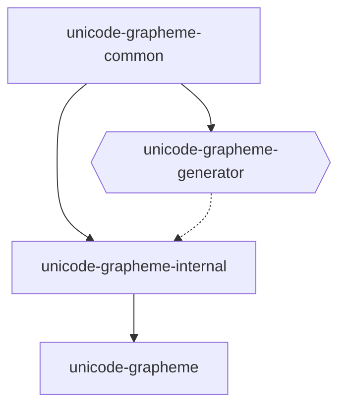

# unicode-grapheme

---

# Description

This repository holds several packages related to handling unicode grapheme clusters. See the [primary readme](#./lib/unicode-grapheme/README.md) for more.

The following diagram explains the dependencies, where a solid line indicates a direct library dependency, and a dotted line indicates some other type of dependency.

